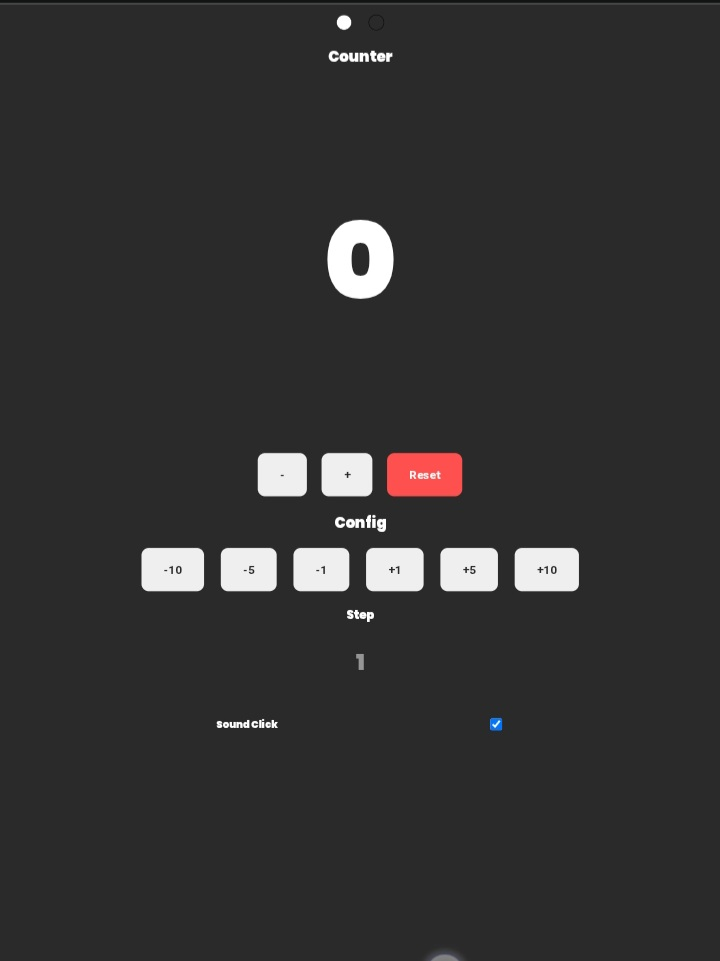
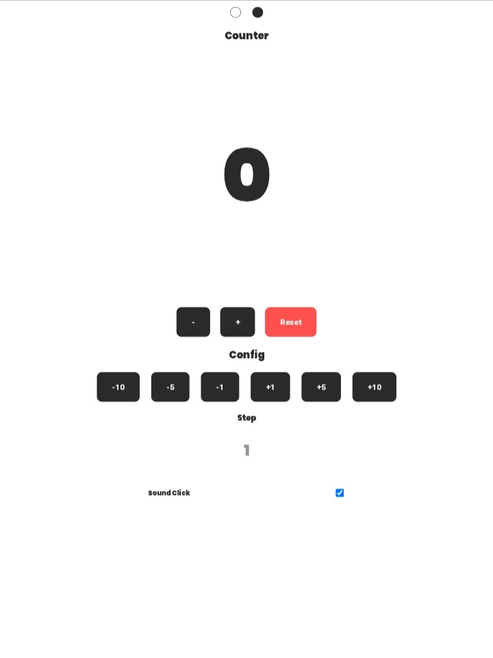

# Counter App

Simple counter web app made with HTML, CSS, and JavaScript.

## 🚀 Features
- Increase and decrease counter
- Dark/Light Theme
- Quick add buttons (+5 , +10)
- Quick subtract buttons (-5 , -10)
- Reset button
- Visual indicator of added/subtracted value
- Sound Click 

## 🛠️ Technologies
- HTML
- CSS
- JavaScript

## 📷 Preview

## 📦 How to Run
Just open `index.html`

## Live Preview
https://alfianolukita.github.io/Counter-App

## Author
AlfianoLukita 

## Version V1.2.0

